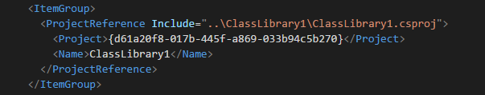

# VSSmartReferences
Visual Studio Smart Reference Fixer it's an extension for Visual Studio 2017 that fixes project references in a way maybe I'm the only one I need.

Take you project references from this

to this

If you prefer to get the compiled release go to the [Visual Studio Gallery](https://marketplace.visualstudio.com/vsgallery/3078528d-b103-43c5-908a-d1646e4c1957)
