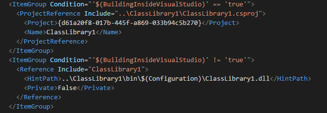

# VSSmartReferences
Visual Studio Smart Reference Fixer it's an extension for Visual Studio 2015 that fixes project references in a way maybe I'm the only one I need.

Take you project references from this

to this

